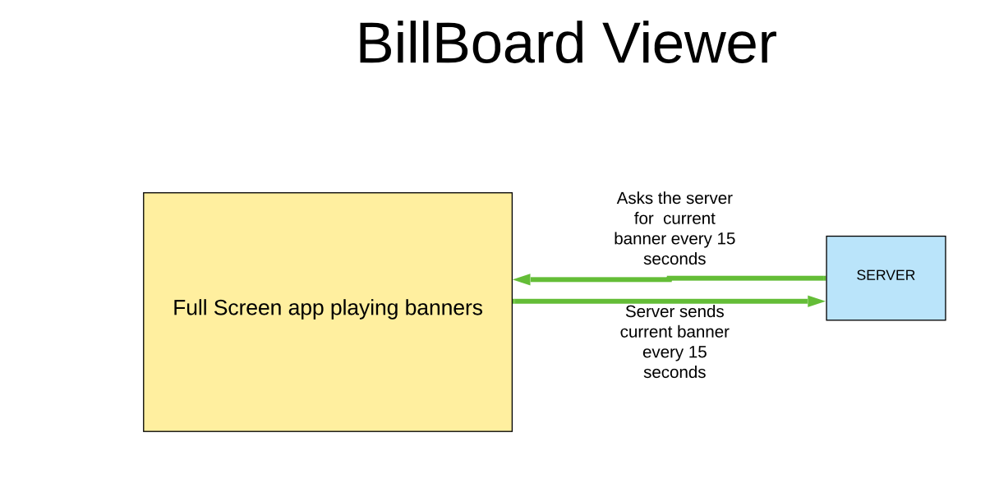
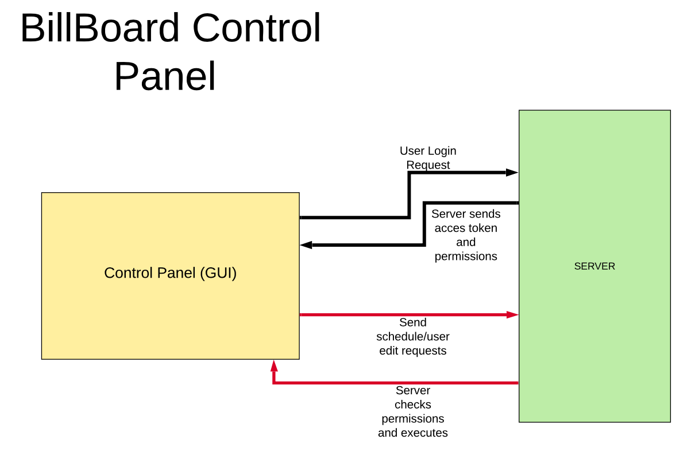
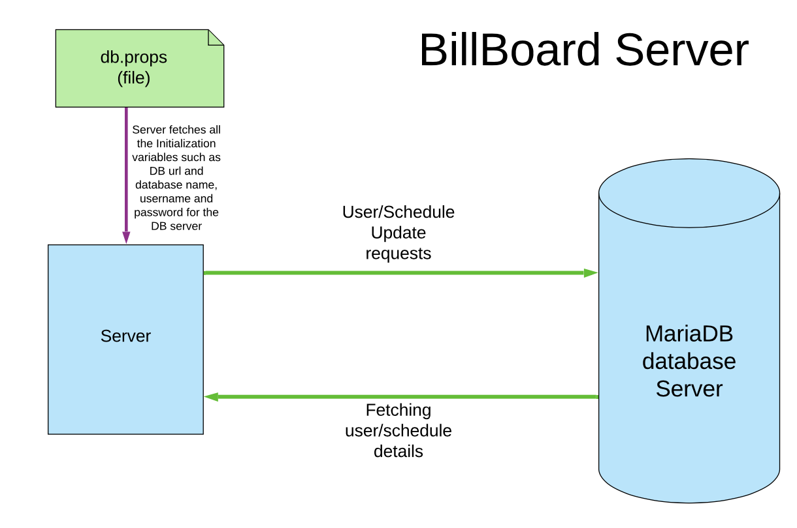

# BillBoard Specification

## Project Structure

- Taking important points forom the **Explicilt Requirements** and **User Stories** I've complied the below diagram explaining the basic functions and the most basic strucuture of the app


## BillBoard Viewer



### Design

- It will make HTTP request to the server every 15 seconds asking for current billboard.
- It will get the message, information,picture url,picture type as an object passed down by the DB(Refer Billboard table) to the server, which the server will give to billboard.
- The viewer will create the XML with the data given by server by template literals as shown :-

```java
String template = "status is %s, data key is %s"
String result = String.format(template, status, key);
```

- There is a boolean value isURL in billboard table. As an image can either be uRL or basencoded string (page - 9 last para). This will let you make the XML better with an if else condition.
- IF the HTTP request fails, or the server doesn't respond. We show the error message.
- In case of incomplete info refer the page number 10 of the Specs.

## BillBoard Control Panel



### Design

- GUI screens/features
  - Login
  - Billboard creation
  - Scheduling BillBoard
  - Billboard delete (ADMIN)
  - User ADD,DELETE,GRANT PERMISSION(ADMIN)
- You will find the detailed description in specs.
- The approach to make this would be :-

  - Login - An HTTP request to server and once hashed password goes to the server. Server does the auth and returns a **token** and makes a new session in session table.
  - Client reaction - The control panel will store this **token in cookies**.
  - At every request now the server will check for the cookies of the request for token.
    It will match the token to the ones in session table. And will retrieve the user by u_id(refer schema) from the db.Once it has the user it also has the information of what permissions does this user have. SO to safe gaurd actions.

- Schedule creation-
  - When a schedule created it will also have the field if it is recuring or not.If it is recuring we will store after what period it reoccurs.
  - Every time the billboard is shown we will change the start_time field (refer db) to
    `start_time = start_time+duration_recuring_period`
  - If it is not recuring it will leave it as it is.
- User actions are pretty easy as there is 1 field for each permission.
- Default user is to be created at the first start of the app.(keep this in mind)

## Server



### Design -
