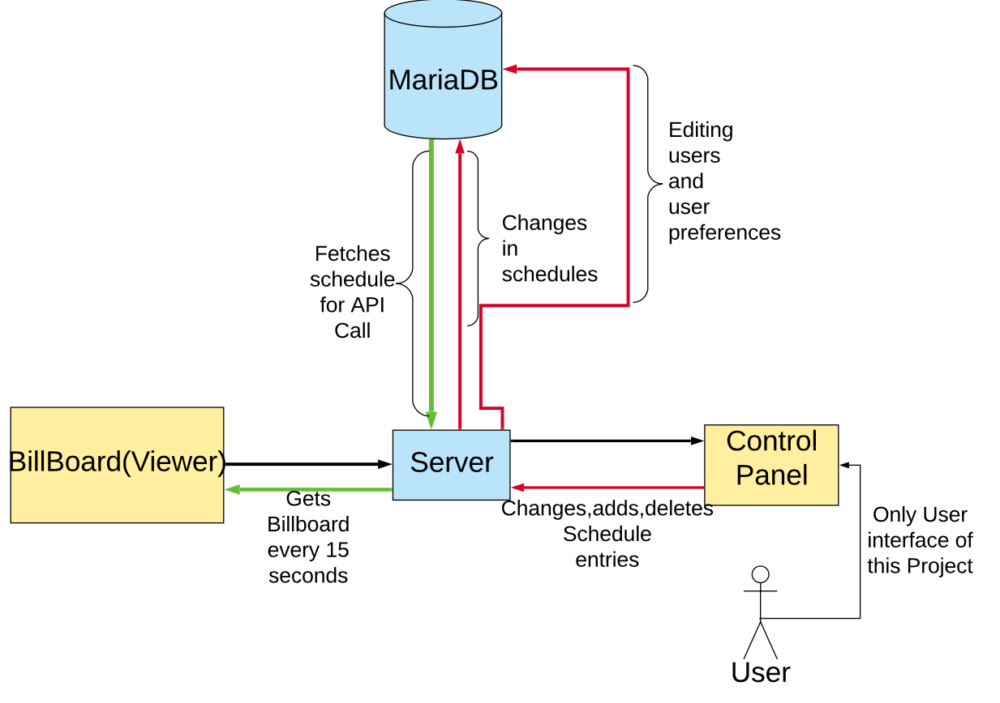

# BillBoard Specification

## Project Structure

- Taking important points forom the **Explicilt Requirements** and **User Stories** I've complied the below diagram explaining the basic functions and the most basic strucuture of the app

String template = "status is %s, data key is %s"
String result = String.format(template, status, key);
